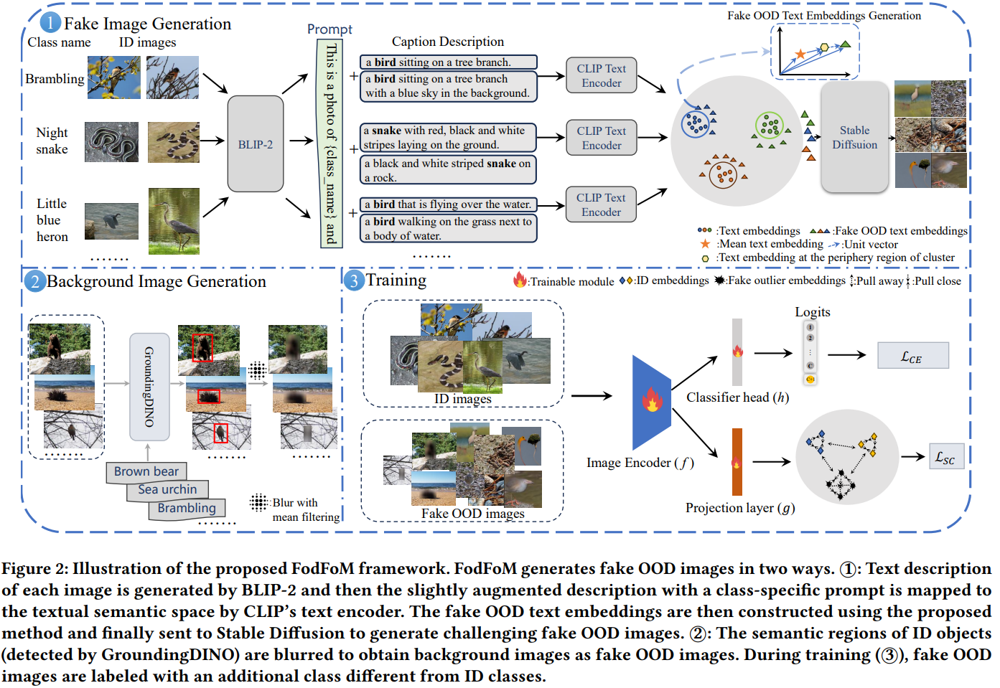
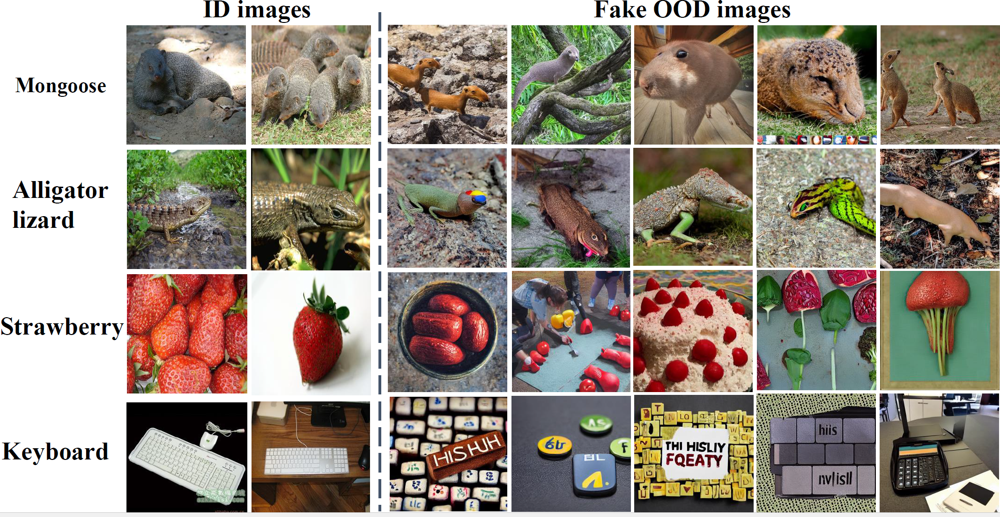
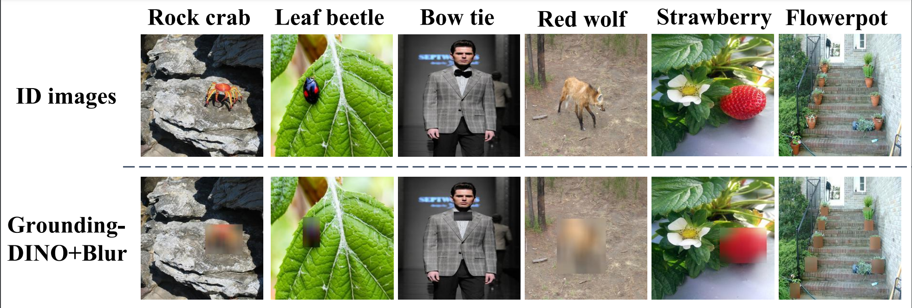

# FodFoM
Code for ACMMM2024 paper: FodFoM: Fake Outlier Data by Foundation Models Creates
Stronger Visual Out-of-Distribution Detector
# Abstract
Out-of-Distribution (OOD) detection is crucial when deploying
machine learning models in open-world applications. The core
challenge in OOD detection is mitigating the model’s overconfi-
dence on OOD data. While recent methods using auxiliary outlier
datasets or synthesizing outlier features have shown promising
OOD detection performance, they are limited due to costly data col-
lection or simplified assumptions. In this paper, we propose a novel
OOD detection framework FodFoM that innovatively combines
multiple foundation models to generate two types of challenging
fake outlier images for classifier training. The first type is based
on BLIP-2’s image captioning capability, CLIP’s vision-language
knowledge, and Stable Diffusion’s image generation ability. Jointly
utilizing these foundation models constructs fake outlier images
which are semantically similar to but different from in-distribution
(ID) images. For the second type, GroundingDINO’s object detection
ability is utilized to help construct pure background images by blur-
ring foreground ID objects in ID images. The proposed framework
can be flexibly combined with multiple existing OOD detection
methods. Extensive empirical evaluations show that image classi-
fiers with the help of constructed fake images can more accurately
differentiate real OOD image from ID ones. New state-of-the-art
OOD detection performance is achieved on multiple benchmarks.
# Method 

# Data Preparation
## CIFAR
### In-distribution dataset
The downloading process will start immediately upon running.  
### Out-of-distribution dataset
We provide links and instructions to download each dataset:  
&bull; [SVHN](http://ufldl.stanford.edu/housenumbers/):download it and place it in the folder of `datasets/SVHN`.  
&bull; [Textures](https://www.robots.ox.ac.uk/~vgg/data/dtd/download/dtd-r1.0.1.tar.gz):download it and place it in the folder of `datasets/dtd`.  
&bull; [Places365](http://data.csail.mit.edu/places/places365/test_256.tar):download it and place it in the folder of `datasets/places365/test_subset`.  
&bull; [LSUN-C](https://www.dropbox.com/s/fhtsw1m3qxlwj6h/LSUN.tar.gz):download it and place it in the folder of `datasets/LSUN_C`.  
&bull; [LSUN-R](https://www.dropbox.com/s/moqh2wh8696c3yl/LSUN_resize.tar.gz):download it and place it in the folder of `datasets/LSUN_R`.  
&bull; [iSUN](https://www.dropbox.com/s/ssz7qxfqae0cca5/iSUN.tar.gz):download it and place it in the folder of `datasets/iSUN`.  
The directory structure looks like:

```python
datasets/
---cifar10/
---cifar100/
---dtd/
---iSUN/
---LSUN_C/
---LSUN_R/
---places365/test_subset
---SVHN/
```
## Large-scale Data
### In-distribution dataset
The ImageNet-1k dataset(ILSVRC-2012) can be downloaded [here](https://image-net.org/challenges/LSVRC/2012/index.php#) and place it in the folder of `datasets/ImageNet`.

ImageNet100 can be generated given the classnames and IDs provided in `data/ImageNet100/ImageNet100_class_list.txt`

To create ImageNet100, the follow scripts can be used:
`python data/create_imagenet_subset.py --in_dataset ImageNet100 --src-dir datasets/ImageNet --dst-dir datasets/ImageNet100`

### Out-of-Distribution dataset
We have curated 4 OOD datasets from [iNaturalist](https://arxiv.org/pdf/1707.06642.pdf), [SUN](https://vision.princeton.edu/projects/2010/SUN/paper.pdf), [Places](http://places2.csail.mit.edu/PAMI_places.pdf), and [Textures](https://arxiv.org/pdf/1311.3618.pdf), and de-duplicated concepts overlapped with ImageNet-100.
For iNaturalist,SUN,and Places,we have sampled 10,000 images from the selected concepts for each dataset, which can be download via following links:
```bash
wget http://pages.cs.wisc.edu/~huangrui/imagenet_ood_dataset/iNaturalist.tar.gz
wget http://pages.cs.wisc.edu/~huangrui/imagenet_ood_dataset/SUN.tar.gz
wget http://pages.cs.wisc.edu/~huangrui/imagenet_ood_dataset/Places.tar.gz
```
For Textures, we use the entire dataset, which can be downloaded from their [original_websit](https://www.robots.ox.ac.uk/~vgg/data/dtd/).
Please pull all download OOD datasets into `datasets/ImageNet_OOD_dataset`.
The directory structure looks like:

```python
datasets/
---ImageNet100/
---ImageNet_OOD_dataset
------dtd/
------iNaturalist/
------Places/
------SUN/
```
# Fake Image Generation-diffusion modal
## Generating text descriptions with blip2
To create text descriptions of three ID datasets with blip2, the follow script can be used:
`python BLIP2_I2T.py`
After running, all the image paths and corresponding text descriptions in the three ID datasets are saved in the corresponding txt files.  
For the convenience of subsequent category name and description correspondence for CIFAR data, run the following code to reorder the generated text descriptions by category index.  
`python description_process.py`
## Fake text embedding generation
In order to generate the false text token as a condition for the pseudo-OOD text data to be given to the subsequent stable diffusion to generate an image, you need to execute the following script:  
`python clip_text.py --dataset ImageNet100 --n_class=100 --percentage 20 --slide=3e-5 --add_slide=3e-5 --fake_feature_path '...' --num_per_sample 5 --fake_token_path '...'`  
After that, fake token data for each category is saved for stable diffusion to generate false images
## Fake Image Generation by fake tokens
Go to the stable diffusion folder, you need to download [openai's clip-vit-large-patch14](https://huggingface.co/openai/clip-vit-large-patch14) and put it under this folder.  
Then go to the scripts/txt2img.py, you need to change #outdir# to hold fake images you will generate  
Run the following script to generate fake ood images(CIFAR and ImageNet100)
`python scripts/txt2img.py --dataset ImageNet100 --n_class 10 --fake_token_path ... --outdir ...`  
# Background Image Generation by GroundingDINO
Go to the GroundingDINO folder, cd 'GroundingDINO/demo'  
The main file that generates the background image is in reference_on_a_image_background.py
You can specify the directory where the background image will be generated by modifying the output_dir in the file.  
In order to better fit the training data, run `python image_path_create.py` to put the CIFAR corresponding fake data and background data paths in the corresponding txt file for subsequent training.
# Visualization
## Fake Image by stable diffusion

## Background Image by GroundingDINO

# Train
After all the fake OOD data has been generated, the following sh file can be run for training:
`sh scripts/cifar10.sh`, `sh scripts/cifar100.sh`, `scripts/imagenet100.sh`  
# Evaluation
After the model has finished training, place the model files in the `saved_model` directory. For version of CIFAR,ImageNet-100, evaluation for OOD detection can be down via `sh Detection/scripts/eval_cifar.sh` or `sh Detection/scripts/eval_imagenet.sh`
